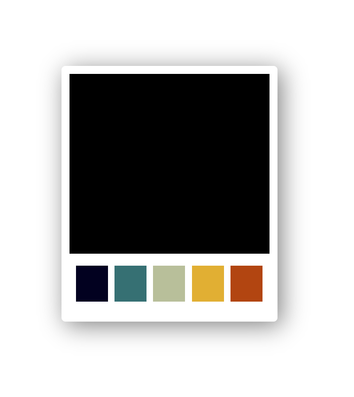

ColorPicker Coding Challenge
===

In this coding challenge you will create a color-picker as shown below.

## Requirements

- IDE/Editor of your choice
- Installation of latest Node 16.x
- Installation of NPM

## Commands

- `npm start` - Starts Dev Server for live coding
- `npm run test` - Runs the tests included with the project

## Task

Recreate the color picker as shown in the picture at the top.
 - Show the current selected color (default is black)
 - When you click one of the colors in the palettes, the current color should change to the clicked 
 
Write your own css into the `./src/ColorPicker.css`.
Write your code into the `.src/ColorPicker.tsx`.

Do NOT change the Tests. The `data-testid`s for the elements you can find inside the tests.
